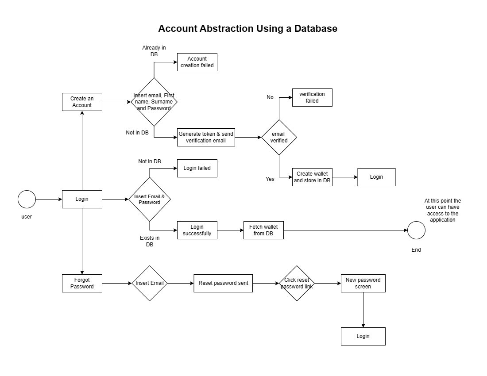
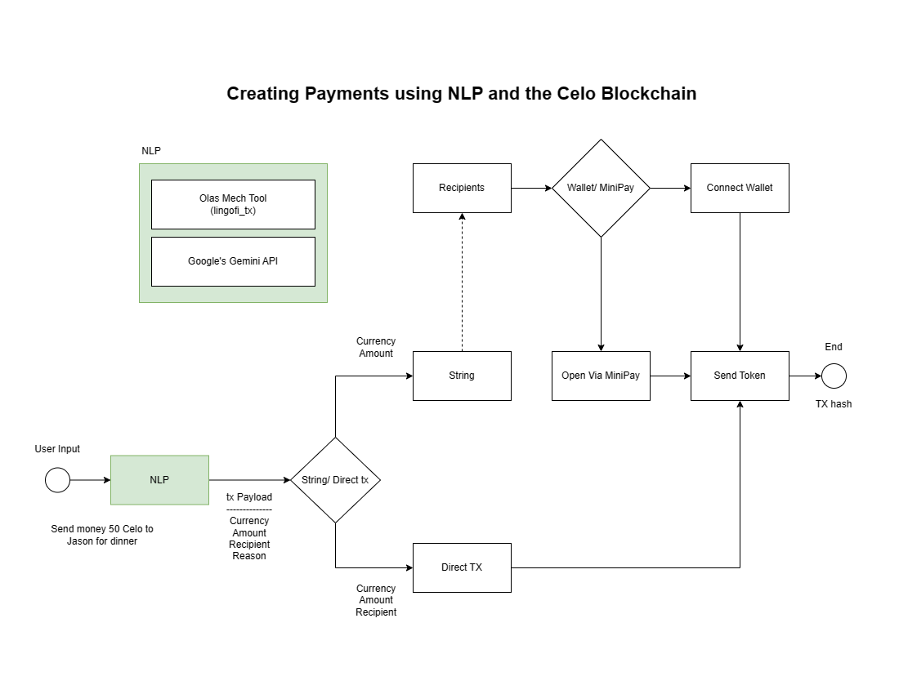

# Lingofi Platform

Welcome to the Lingofi repository! Lingofi leverages cutting-edge blockchain and AI technologies to transform financial services in Africa by making them accessible and affordable. This platform breaks down language barriers and extends financial inclusion to underserved communities through a user-friendly interface.

## Project Overview

Lingofi consists of several components that work together to provide a seamless user experience:
- **Lingofi Chat**: An AI-driven chat interface that allows users to conduct transactions and access financial services in their native languages.
- **Mech App**: Powers the natural language understanding capabilities of the platform using advanced AI.
- **Backend Services**: Manages all backend processes including authentication and transaction processing.
- **Frontend**: Provides the interface through which users interact with Lingofi services.

## Architecture

Below is an overview of the Lingofi architecture, illustrating how each component of the system interacts.

## Account Abstraction Architecture

## Userflow Architecture

## Video Demo

Check out our [video demo](https://youtu.be/sNSzV0zVQow) to see Lingofi in action! The demo covers key features and functionalities of the platform, showcasing how easy and intuitive it is to use Lingofi for financial transactions.

## Apps Description

### Lingofi Chat
Lingofi Chat is designed to simplify user interaction with financial services. It uses NLP to understand and process user requests in various languages, enabling easy access to financial transactions and services.

### Mech App
The Mech App integrates with Lingofi Chat to provide real-time language processing. It is built using Python and Flask and is essential for the translation and execution of user commands.

### Backend Services
The backend is built on Node.js and handles all critical operations from user management to transaction processing. It ensures the platform operates smoothly and securely.

### Frontend
The frontend is developed using Next.js, providing a responsive and dynamic user interface that interacts seamlessly with the backend and blockchain components.

## Getting Started

To get started with Lingofi, please follow the detailed setup instructions in the README files located in each application's directory:
- [Lingofi Chat README](./lingofi-chat/README.md)
- [Mech App README](./lingofi-mech/lingofi_tx/README.md)
- [Server README](./lingofi-server/README.md)
- [String README](./lingofi-string//README.md)

These guides will help you set up each component of the platform on your local machine.
